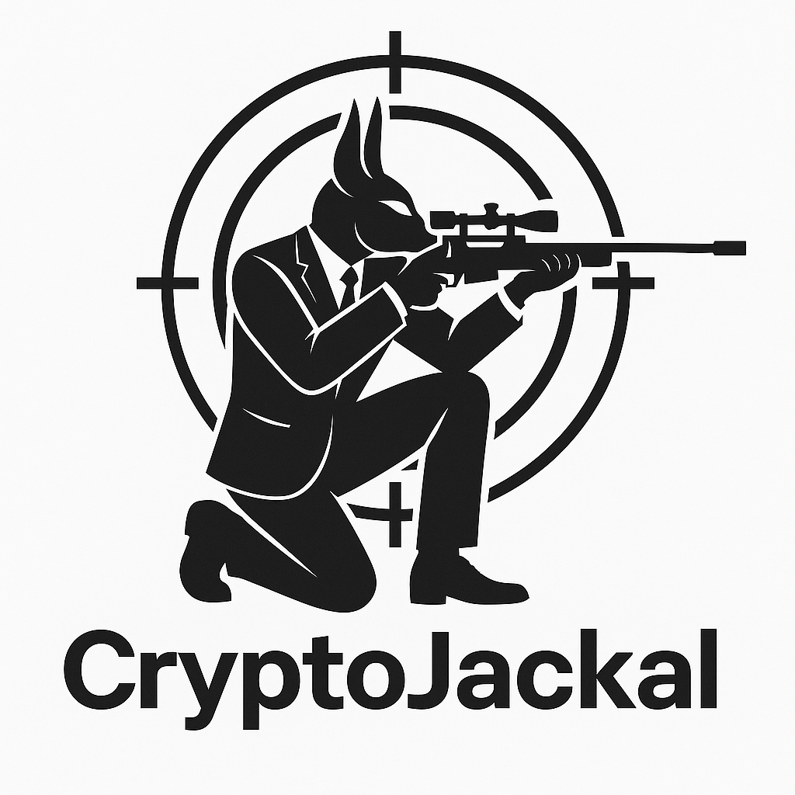

# CryptoJackal



A high-performance cryptocurrency sniper bot built in Rust, designed for rapid trading execution on Uniswap V2/V3 with MetaMask-only integration for maximum security.

## Features

- **High-speed trading execution** with optimized gas strategies
- **Zero private key storage** with MetaMask-only wallet integration
- **Real-time market monitoring** via Uniswap subgraph WebSocket
- **MEV protection** against front-running and sandwich attacks
- **Order execution queue** with prioritization and lifecycle management
- **Gas price optimization** for cost-effective transactions
- **Comprehensive testing suite** and performance monitoring

## Project Structure

```
src/
├── core/           # Core bot functionality
├── wallet/         # Wallet integration and management
├── trading/        # Trading logic and execution
└── utils/          # Utility functions and helpers
```

## Prerequisites

### Essential Requirements
- **Rust 1.70.0 or higher** - [Install from rustup.rs](https://rustup.rs/)
- **MetaMask Browser Extension** - [Download from metamask.io](https://metamask.io/download/)
- **Ethereum Node Access** - Choose one:
  - [Infura](https://infura.io/) - Free tier available, create project for API key
  - [Alchemy](https://www.alchemy.com/) - Free tier with 300M compute units/month
  - [QuickNode](https://www.quicknode.com/) - Free tier available
  - Local node (Geth/Erigon) - Advanced users only

### Trading Capital Requirements
- **Minimum ETH Balance**: 0.1 ETH recommended for gas fees and small trades
- **Recommended Starting Capital**: 0.5-1.0 ETH for meaningful trading
- **Gas Reserve**: Always keep 0.05-0.1 ETH for transaction fees

## Installation

1. Clone the repository:
```bash
git clone https://github.com/twadelij/CryptoJackal.git
cd CryptoJackal
```

2. Install dependencies:
```bash
cargo build
```

3. Configure your environment:
```bash
cp .env.example .env
# Edit .env with your configuration
```

## Configuration Guide

### Environment Variables Explained

#### Node Configuration
- **NODE_URL**: Your Ethereum node RPC endpoint
  - Example: `https://mainnet.infura.io/v3/YOUR_PROJECT_ID`
  - Get from [Infura](https://infura.io/), [Alchemy](https://alchemy.com/), or [QuickNode](https://quicknode.com/)
  - **Required**: Yes

#### Trading Parameters
- **SCAN_INTERVAL**: Milliseconds between market scans (default: 1000)
  - Lower = faster detection, higher CPU usage
  - Recommended: 500-2000ms

- **GAS_LIMIT**: Maximum gas units per transaction (default: 300000)
  - **What it is**: Gas limit prevents runaway transactions
  - **Safety**: Acts as a spending cap on transaction fees
  - **Typical values**: 200000-500000
  - **Cost example**: At 50 gwei, 300000 gas = ~0.015 ETH max fee

- **SLIPPAGE_TOLERANCE**: Price movement tolerance (default: 0.005 = 0.5%)
  - **What it is**: Maximum acceptable price change during trade execution
  - **Example**: 0.01 = 1%, 0.005 = 0.5%
  - **Recommendation**: 0.5-2% for most tokens

- **MIN_LIQUIDITY**: Minimum pool liquidity in ETH (default: 10.0)
  - **Purpose**: Avoid low-liquidity pools that cause high slippage
  - **Safety**: Prevents trading in risky/manipulated pools

- **MAX_PRICE_IMPACT**: Maximum price impact tolerance (default: 0.02 = 2%)
  - **What it is**: How much your trade affects the token price
  - **Safety**: Prevents trades that would move price significantly

- **TRADE_AMOUNT**: Trade size in wei (default: 100000000000000000 = 0.1 ETH)
  - **Convert ETH to wei**: 1 ETH = 1000000000000000000 wei
  - **Safety**: This is your maximum trade size per transaction

#### Target Tokens
- **TARGET_TOKENS**: Comma-separated token contract addresses
  - **Format**: `0x1f9840a85d5aF5bf1D1762F925BDADdC4201F984,0x6B175474E89094C44Da98b954EedeAC495271d0F`
  - **How to find**: See "Finding Token Addresses" section below

### Finding Token Addresses

#### Popular Token Addresses (Ethereum Mainnet)
```bash
# Major tokens you might want to trade
UNI=0x1f9840a85d5aF5bf1D1762F925BDADdC4201F984   # Uniswap
DAI=0x6B175474E89094C44Da98b954EedeAC495271d0F   # Dai Stablecoin
USDC=0xA0b86a33E6441b8C4C8C8C8C8C8C8C8C8C8C8C8   # USD Coin
WETH=0xC02aaA39b223FE8D0A0e5C4F27eAD9083C756Cc2   # Wrapped Ether
LINK=0x514910771AF9Ca656af840dff83E8264EcF986CA   # Chainlink
```

#### How to Find New Token Addresses
1. **CoinGecko**: Visit token page → Contract address
2. **CoinMarketCap**: Token page → Contracts section
3. **Etherscan**: Search token name → Contract address
4. **Uniswap Interface**: Token info shows contract address
5. **DexScreener**: Real-time new token discovery

#### New Token Discovery Resources
- **DexScreener**: [dexscreener.com](https://dexscreener.com/) - Real-time new pairs
- **Uniswap Info**: [info.uniswap.org](https://info.uniswap.org/) - Official analytics
- **DEXTools**: [dextools.io](https://dextools.io/) - Advanced trading tools
- **Token Sniffer**: [tokensniffer.com](https://tokensniffer.com/) - Security analysis

## Safety Controls & Spending Limits

### Built-in Safety Mechanisms
- **Gas Limit Cap**: `GAS_LIMIT` prevents excessive transaction fees
- **Trade Amount Limit**: `TRADE_AMOUNT` caps individual trade size
- **Slippage Protection**: `SLIPPAGE_TOLERANCE` prevents bad fills
- **Liquidity Checks**: `MIN_LIQUIDITY` avoids risky pools
- **Price Impact Limits**: `MAX_PRICE_IMPACT` prevents market manipulation
- **MetaMask Approval**: Every transaction requires manual approval

### Recommended Safety Settings
```bash
# Conservative settings for beginners
TRADE_AMOUNT=50000000000000000    # 0.05 ETH per trade
GAS_LIMIT=250000                  # Lower gas limit
SLIPPAGE_TOLERANCE=0.01          # 1% slippage
MAX_PRICE_IMPACT=0.01            # 1% price impact
MIN_LIQUIDITY=50.0               # Higher liquidity requirement
```

### Daily/Total Spending Controls
- **Per Transaction**: Limited by `TRADE_AMOUNT` setting
- **Gas Costs**: Limited by `GAS_LIMIT` × current gas price
- **Manual Control**: Every trade requires MetaMask confirmation
- **No Automatic Spending**: Bot cannot spend without your approval

## Usage

### Quick Start
1. Configure your trading parameters in `.env`
2. Run the bot:
```bash
cargo run --release
```

### Demo Mode (Safe Testing)
```bash
# Run demo without real trading
cargo run --bin demo
```

## Security Considerations

- **Zero Private Key Storage**: All transaction signing is delegated to MetaMask
- **No Private Keys in Code or Config**: The system is designed to never require or store private keys
- **Environment Variables**: Use environment variables for node URLs and other sensitive data
- **Regular Dependency Audits**: All dependencies are regularly audited for security vulnerabilities
- **Testnet First**: Always test thoroughly on testnet before mainnet deployment

## Future Features & Roadmap

### Upcoming Features
- **🆕 New Token Detection**: Automatic discovery of newly launched tokens
  - Real-time monitoring of new Uniswap pairs
  - Filter by liquidity, volume, and safety metrics
  - Early entry opportunities for legitimate projects

- **📊 Advanced Analytics**: Enhanced market analysis
  - Technical indicators (RSI, MACD, Bollinger Bands)
  - Volume analysis and trend detection
  - Whale wallet tracking and copy trading

- **🤖 AI-Powered Trading**: Machine learning integration
  - Pattern recognition for profitable setups
  - Risk assessment algorithms
  - Automated strategy optimization

- **📱 Mobile Notifications**: Real-time alerts
  - Telegram/Discord bot integration
  - Push notifications for opportunities
  - Trade execution confirmations

- **🔄 Multi-DEX Support**: Expand beyond Uniswap
  - SushiSwap integration
  - PancakeSwap (BSC) support
  - Arbitrage opportunities across DEXes

- **⚡ MEV Protection Plus**: Advanced protection
  - Private mempool submission
  - Flashloan arbitrage detection
  - Sandwich attack prevention

### Daily New Token Discovery
**Q: Can I lookup which cryptocoin is released today?**

**A: Yes! Here's how to find today's new tokens:**

1. **DexScreener New Pairs**: [dexscreener.com/new-pairs](https://dexscreener.com/new-pairs)
   - Real-time new token launches
   - Filter by blockchain, age, volume
   - Safety indicators and liquidity metrics

2. **Uniswap Analytics**: [info.uniswap.org/#/pools](https://info.uniswap.org/#/pools)
   - Sort by "Created" to see newest pools
   - Check liquidity and volume before trading

3. **Token Discovery APIs**: 
   - CoinGecko API for new listings
   - CoinMarketCap new token feeds
   - DEXTools trending section

4. **Social Media Monitoring**:
   - Twitter crypto announcement accounts
   - Telegram alpha groups (be cautious of scams)
   - Reddit r/CryptoMoonShots (high risk)

**⚠️ New Token Safety Warning**: New tokens carry extreme risk. Many are scams, rug pulls, or have no real utility. Always:
- Check contract verification on Etherscan
- Verify team and project legitimacy
- Start with very small amounts
- Use tools like Token Sniffer for security analysis

## Testing

Run the test suite:
```bash
cargo test
```

### Testing New Configurations
```bash
# Test with demo mode first
cargo run --bin demo

# Test with small amounts on testnet
# (Update NODE_URL to Goerli/Sepolia testnet)
```

## Contributing

1. Fork the repository
2. Create your feature branch
3. Commit your changes
4. Push to the branch
5. Create a Pull Request

## License

This project is licensed under the MIT License - see the LICENSE file for details.

## Disclaimer

Trading cryptocurrencies carries significant risk. This bot is provided as-is with no guarantees. Use at your own risk.
